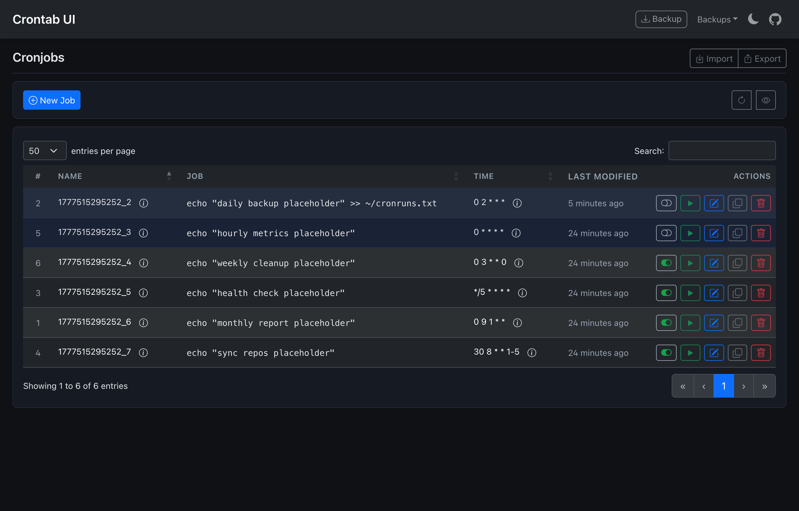
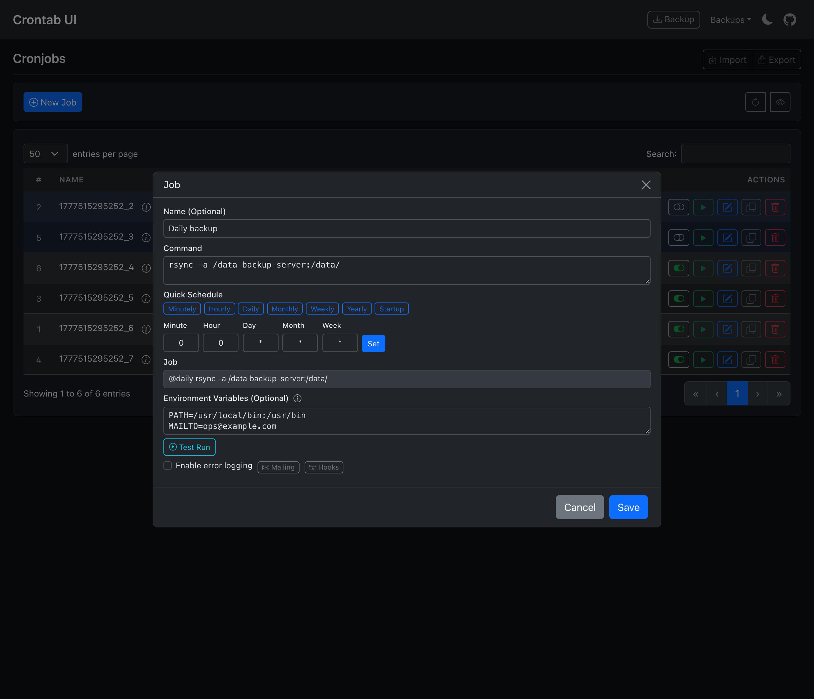

Crontab UI
==========

[](https://www.paypal.com/cgi-bin/webscr?cmd=_s-xclick&hosted_button_id=U8328Q7VFZMTS)
[](https://lifepluslinux.blogspot.com/2015/06/crontab-ui-easy-and-safe-way-to-manage.html)
[](https://lifepluslinux.blogspot.com/2015/06/crontab-ui-easy-and-safe-way-to-manage.html)
[](https://lifepluslinux.blogspot.com/2015/06/crontab-ui-easy-and-safe-way-to-manage.html)
[](https://lifepluslinux.blogspot.com/2015/06/crontab-ui-easy-and-safe-way-to-manage.html)
[](https://lifepluslinux.blogspot.com/2015/06/crontab-ui-easy-and-safe-way-to-manage.html)

> **macOS users:** grab the native desktop app — [Download `Crontab-UI-0.4.3-arm64.dmg`](https://github.com/kanihal/crontab-ui/releases/latest) (Apple Silicon) or `-x64.dmg` for Intel. No Node setup required; the server runs in the background and tears down on quit. After the DMG, drag **Crontab UI** to `/Applications` and run `xattr -dr com.apple.quarantine "/Applications/Crontab UI.app"` once to clear the unsigned-build warning. Cron data lives at `~/Library/Application Support/crontab-ui/crontabs/`.

## Update — 2026-04-30: dark-mode polish, navbar Backup, instant toggle

The UI now reads cleanly in dark mode end-to-end and a few rough edges are gone:





- **Dark mode fixes** — disabled-job rows used Bootstrap's hard-coded `.table-primary` (light blue with black text) and were nearly unreadable on a dark background. They now use a deeper indigo-tinted shade with themed text. The Test Run output and the Crontab Preview panes also got a near-black background plus a slate border so they stand out from the modal body instead of blending in.
- **Backup moved to the navbar** — `Backup` is now a bordered nav-link sitting just before the `Backups` dropdown, pulling that primary action out of the page header.
- **Tighter Quick Schedule pills** — the seven preset buttons (Minutely, Hourly, …, Startup) shrank to match the rest of the modal density.
- **Outlined, color-coded row actions** — Run (green), Edit (blue), stderr-log (red), stdout-log (cyan), Duplicate (gray), Delete (red). All transparent-background outlines so they're visually equal-weight; the enable/disable pill picks up a matching muted-tone border.
- **Toggle without a full reload** — flipping enable/disable now updates the row in place (icon, tooltip, row highlight) instead of forcing a `location.reload()`. Search filter, sort, scroll position, and pagination are all preserved.
- **Back button on the backup viewing page** — returns to the cronjobs listing (or `BASE_URL` if configured).
- **Looser default rate limit** — bumped `express-rate-limit` from `300 req / 15 min` to `1000 req / 10 min`. With DataTables + Bootstrap-icons fonts + several refreshes, the old budget tripped during normal use.
- **Live schedule preview in the Job modal** — a read-only field next to the **Set** button shows the cron expression in plain English (powered by [`cronstrue`](https://github.com/bradymholt/cRonstrue), bundled client-side). It updates as you type in any of the Minute/Hour/Day/Month/Week fields, on every Quick Schedule click, and when you open an existing job for editing. Stays blank for the all-`*` default and for half-typed expressions so it doesn't shout "invalid" while you're still working.

---

## Recent UI improvements


This fork includes a visual refresh of the UI:

- **Constrained layout** — content is now centered with a max-width of 1280px so rows stay readable on wide monitors.
- **Card-based sections** — environment variables, toolbar, and the job table sit in tidy rounded cards on a soft background.
- **Reorganized toolbar** — `New Job` on the left; `Get from crontab` → 👁 preview → `Save to crontab` grouped on the right; `Backup`, `Import`, `Export` moved to the page header.
- **Compact, icon-only row actions** with hover tooltips — Run now, Edit, enable/disable toggle, Duplicate, Delete. Distinct toggle icons (green pill = running, gray pill = stopped) replace the previous duplicated play icons.
- **Tighter table** — narrower `#` and `Last Modified` columns, monospace command text, hover row tint, uppercase header labels.
- **Compact edit modal** — fits on one screen without scrolling; smaller form controls, inline cron-field labels, scrollable body so Save/Cancel stay visible.
- **Quick Schedule presets that fill the cron fields** — the seven preset buttons (Minutely, Hourly, Daily, Monthly, Weekly, Yearly, Startup) sit on a single uniform-height row and now populate the Minute/Hour/Day/Month/Week inputs in addition to setting the schedule string, so you can pick a preset and fine-tune from there.
- **Inline Test Run** — a **Test Run** button in the Job modal executes the command (with the configured environment variables prepended) and shows the exit code, stdout, and stderr inline below the button. No need to wait for the next cron tick or open a terminal to verify your command works.
- **Per-job environment variables** — an **Environment Variables (Optional)** field in the Job modal accepts one `KEY=value` per line (e.g. `PATH=/usr/local/bin:/usr/bin`, `MAILTO=ops@example.com`). The values are prepended to the job's command at deploy time and during Test Run, so you don't have to bake them into a wrapper script.
- **Refined navbar** — brand left-aligned with the page content; `Backups` dropdown and a GitHub icon right-aligned.

---

Editing the plain text crontab is error prone for managing jobs, e.g., adding jobs, deleting jobs, or pausing jobs. A small mistake can easily bring down all the jobs and might cost you a lot of time. With Crontab UI, it is very easy to manage crontab. Here are the key features of Crontab UI.


1. Easy setup. You can even import from existing crontab.
2. Safe adding, deleting or pausing jobs. Easy to maintain hundreds of jobs.
3. Backup your crontabs.
4. Export crontab and deploy on other machines without much hassle.
5. Error log support.
6. Mailing and hooks support.

Read [this](https://lifepluslinux.blogspot.com/2015/06/crontab-ui-easy-and-safe-way-to-manage.html) to see more details.

## Setup

Get latest `node` from [here](https://nodejs.org/en/download/current/). Then,

    npm install -g crontab-ui
    crontab-ui

If you need to set/use an alternative host, port OR base url, you may do so by setting an environment variable before starting the process:

    HOST=0.0.0.0 PORT=9000 BASE_URL=/alse crontab-ui

By default, db, backups and logs are stored in the installation directory. It is **recommended** that it be overriden using env variable `CRON_DB_PATH`. This is particularly helpful in case you **update** crontab-ui.

    CRON_DB_PATH=/path/to/folder crontab-ui
    
If you need to apply basic HTTP authentication, you can set user name and password through environment variables:

    BASIC_AUTH_USER=user BASIC_AUTH_PWD=SecretPassword
    
Also, you may have to **set permissions** for your `node_modules` folder. Refer [this](https://docs.npmjs.com/getting-started/fixing-npm-permissions).

If you need to use SSL, you can pass the private key and certificate through environment variables:

    SSL_CERT=/path/to/ssl_certificate SSL_KEY=/path/to/ssl_private_key

Make sure node has the correct **permissions** to read the certificate and the key.

If you need to autosave your changes to crontab directly:

    crontab-ui --autosave

### List of environment variables supported
- HOST
- PORT
- BASE_URL
- CRON_DB_PATH
- CRON_PATH
- BASIC_AUTH_USER, BASIC_AUTH_PWD
- SSL_CERT, SSL_KEY 
- ENABLE_AUTOSAVE


## Docker
You can use crontab-ui with docker. You can use the prebuilt images in the [dockerhub](https://hub.docker.com/r/alseambusher/crontab-ui/tags)
```bash
docker run -d -p 8000:8000 alseambusher/crontab-ui
```

You can also build it yourself if you want to customize, like this:
```bash
git clone https://github.com/alseambusher/crontab-ui.git
cd crontab-ui
docker build -t alseambusher/crontab-ui .
docker run -d -p 8000:8000 alseambusher/crontab-ui
```

If you want to use it with authentication, You can pass `BASIC_AUTH_USER` and `BASIC_AUTH_PWD` as env variables
```bash
docker run -e BASIC_AUTH_USER=user -e BASIC_AUTH_PWD=SecretPassword -d -p 8000:8000 alseambusher/crontab-ui 
```

You can also mount a folder to store the db and logs.
```bash
mkdir -p crontabs/logs
docker run --mount type=bind,source="$(pwd)"/crontabs/,target=/crontab-ui/crontabs/ -d -p 8000:8000 alseambusher/crontab-ui
```

If you are looking to modify the host's crontab, you would have to mount the crontab folder of your host to that of the container. 
```bash
# On Ubuntu, it can look something like this and /etc/cron.d/root is used
docker run -d -p 8000:8000 -v /etc/cron.d:/etc/crontabs alseambusher/crontab-ui
```

    
## Resources

* [Full usage details](https://lifepluslinux.blogspot.com/2015/06/crontab-ui-easy-and-safe-way-to-manage.html)
* [Issues](https://github.com/alseambusher/crontab-ui/blob/master/README/issues.md)
* [Setup Mailing after execution](https://lifepluslinux.blogspot.com/2017/03/introducing-mailing-in-crontab-ui.html)
* [Integration with nginx and authentication](https://github.com/alseambusher/crontab-ui/blob/master/README/nginx.md)
* [Setup on Raspberry pi](https://lifepluslinux.blogspot.com/2017/03/setting-up-crontab-ui-on-raspberry-pi.html)

### Adding, deleting, pausing and resuming jobs.

Once setup Crontab UI provides you with a web interface using which you can manage all the jobs without much hassle.


### Import from existing crontab

Import from existing crontab file automatically.


### Backup and restore crontab

Keep backups of your crontab in case you mess up.


### Export and import crontab on multiple instances of Crontab UI.

If you want to run the same jobs on multiple machines simply export from one instance and import the same on the other. No SSH, No copy paste!


A backup is created automatically before importing.

### Separate error log support for every job


### Donate
Like the project? [Buy me a coffee](https://www.paypal.com/cgi-bin/webscr?cmd=_s-xclick&hosted_button_id=U8328Q7VFZMTS)!

### Contribute
Fork Crontab UI and contribute to it. Pull requests are encouraged.

### License
[MIT](LICENSE.md)
